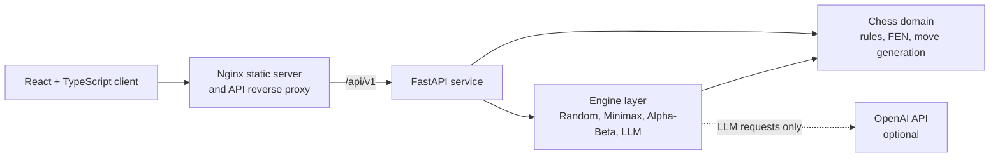

# BukoChess

[](https://github.com/UeMaBel/bukochess/actions/workflows/ci.yml)
[](https://www.python.org/)
[](https://fastapi.tiangolo.com/)
[](https://react.dev/)
[](https://www.typescriptlang.org/)
[](LICENSE)

BukoChess is a full-stack chess application built to explore the engineering behind chess software. The rules engine, board representations, legal move generation, position hashing, and classical search engines are implemented in Python rather than delegated to an external chess engine.

The project combines that chess core with a FastAPI service, a React and TypeScript client, optional LLM-based move selection, Docker Compose, and automated CI.

> **Project status:** Active development. The web application is playable, the OpenAI integration is functional when configured, and the classical engines require no external service. Anthropic and local LLM providers are extension points and are not implemented yet.

## Highlights

- **Custom chess domain layer:** FEN parsing and serialization, legal move generation, checks, checkmates, stalemates, castling, en passant, promotion, repetition tracking, and insufficient-material detection.
- **Search built from first principles:** random and minimax baselines plus iterative-deepening alpha-beta search with quiescence search, move ordering, killer moves, and a transposition table.
- **Incremental position state:** apply/undo operations maintain board state, evaluation data, and Zobrist hashes for recursive search.
- **Perft validation:** the move generator is checked against a broad suite of reference positions and node counts, including difficult castling, promotion, and en-passant cases.
- **Extensible engine API:** all engines implement a common interface and return typed results with engine-specific diagnostics in metadata.
- **LLM safety boundary:** a provider may select from legal moves, but the chess layer remains authoritative and rejects illegal provider output.
- **Full-stack client:** independent White and Black player selection, configurable search depth, promotion UI, board flipping, move history, engine diagnostics, and optional AI explanations.
- **Production-style packaging:** separate backend and frontend images, an Nginx reverse proxy, service health checks, non-root backend execution, and one-command startup through Docker Compose.

## Architecture



The backend owns the authoritative chess rules and engine execution. Positions cross the stateless HTTP boundary as FEN, and the frontend never needs direct access to an LLM provider or its credentials.

## Engines

| Engine | Approach | Configuration | External service |
| --- | --- | --- | --- |
| Random | Uniform choice from legal moves | Optional deterministic seed | No |
| Dumb | Depth-limited minimax with material and positional evaluation | Depth, optional seed | No |
| Alpha Beta | Iterative deepening, alpha-beta pruning, quiescence search, transposition table, and move ordering | Depth, optional seed | No |
| LLM | Sends the FEN and server-generated legal-move list to a provider, then validates the selected move | Provider, model, reasoning effort, token limit, explanation | OpenAI key currently required |

Alpha-beta responses expose diagnostics such as searched nodes, cutoffs, first-move cutoffs, transposition-table hits, quiescence calls, and evaluation. This makes engine behavior observable from the UI rather than hiding it inside the search implementation.

## Quick start with Docker

Prerequisites:

- Docker with the Compose plugin
- Git

Clone the repository and create the local environment file:

```bash
git clone https://github.com/UeMaBel/bukochess.git
cd bukochess
cp .env.example .env
```

On Windows PowerShell, use this instead of `cp`:

```powershell
Copy-Item .env.example .env
```

Build and start both services:

```bash
docker compose up --build
```

| Service | URL |
| --- | --- |
| Web application | http://localhost:8080 |
| Backend API | http://localhost:8000 |
| Interactive API documentation | http://localhost:8000/docs |

The backend health check gates frontend startup. Nginx serves the compiled React application and proxies `/api/v1` requests to the backend over the internal Compose network.

Stop the stack with:

```bash
docker compose down
```

## Configuration

The defaults in `.env.example` run all non-LLM engines without additional configuration.

| Variable | Default | Purpose |
| --- | --- | --- |
| `FRONTEND_PORT` | `8080` | Frontend port exposed on the host |
| `BACKEND_PORT` | `8000` | Backend port exposed on the host |
| `APP_NAME` | `Bukochess Backend` | FastAPI application title |
| `API_V1_PREFIX` | `/api/v1` | Versioned API prefix |
| `DEBUG` | `false` | Backend debug mode |
| `BACKEND_URL` | `http://backend:8000` | Internal upstream used by Nginx |
| `OPENAI_API_KEY` | empty | Optional; enables the OpenAI engine |

Never commit `.env` or an API key. The file is excluded by `.gitignore`.

## Local development

### Backend

Python 3.12 is the supported runtime used by Docker and CI.

```bash
cd backend
python -m venv .venv
```

Activate the environment:

```bash
# Linux/macOS
source .venv/bin/activate

# Windows PowerShell
.\.venv\Scripts\Activate.ps1
```

Install dependencies and start the API:

```bash
python -m pip install -r requirements.txt
uvicorn app.main:app --reload
```

For local LLM use, provide `OPENAI_API_KEY` through your environment or a `backend/.env` file. It is not needed for the classical engines or automated tests.

### Frontend

Node.js 22 is the supported runtime used by Docker and CI.

```bash
cd frontend
npm ci
npm run dev
```

The development server runs at http://localhost:5173 and proxies `/api/v1` to the backend at http://127.0.0.1:8000.

## Tests and quality checks

The backend suite covers the chess domain, API validation, engine behavior, LLM error handling, perft reference positions, and apply/undo symmetry. LLM tests mock provider calls and do not require a real API key.

```bash
cd backend
pytest
```

The frontend suite verifies the typed API clients with mocked HTTP requests:

```bash
cd frontend
npm ci
npm test
npm run lint
npm run build
```

Useful focused frontend commands:

```bash
npm run test:api
npm run test:api:watch
```

## HTTP API

All application routes are under `/api/v1`.

| Method | Endpoint | Purpose |
| --- | --- | --- |
| `GET` | `/health` | Service health check |
| `POST` | `/position/fen` | Parse a FEN position into a board representation |
| `POST` | `/position/validate` | Validate a FEN string |
| `POST` | `/position/legal-moves` | Return legal UCI moves, optionally filtered by square |
| `POST` | `/game/move` | Validate and apply a human move |
| `POST` | `/game/fast-move` | Apply a move for the interactive client |
| `POST` | `/game/status` | Return side to move, check state, and game status |
| `POST` | `/engine/move` | Ask the selected engine to choose and apply a legal move |

FastAPI publishes the complete, executable OpenAPI contract at `/docs` while the service is running.

## Repository structure

```text
bukochess/
├── backend/
│   ├── app/
│   │   ├── ai/                 # Provider contracts, settings, and integrations
│   │   ├── api/                # FastAPI HTTP boundary
│   │   ├── chess/              # Rules, boards, move generation, hashing, engines
│   │   └── core/               # Configuration, logging, exception handling
│   └── tests/                  # Domain, API, engine, AI, and perft tests
├── frontend/
│   ├── nginx/                  # Production reverse-proxy template
│   └── src/
│       ├── api/                # Typed request, response, and settings contracts
│       ├── components/         # Game board and controls
│       └── styles/             # Component styles
├── scripts/                    # Optional API and engine development utilities
├── .github/workflows/ci.yml    # Branch-aware GitHub Actions workflow
└── compose.yaml                # Local production-style stack
```

## Continuous integration

GitHub Actions runs on pinned Ubuntu 24.04 runners:

- Pushes and merges to `development` run backend tests, frontend tests, linting, and a production frontend build.
- Pushes and merges to `main` run the same checks and build both Docker images after the tests pass.
- The workflow can also be started manually.

The pipeline builds images but does not publish or deploy them.

### Container image availability

The Docker images built after a merge to `main` exist only on the temporary GitHub Actions runner. The build verifies that both Dockerfiles and the Compose configuration can produce working images, but those images are discarded when the workflow finishes.

For the current setup, users therefore clone the repository and build the images locally with `docker compose up --build`. Running BukoChess without cloning would require an additional packaging step that publishes versioned images to a registry such as GitHub Container Registry. Image publishing is intentionally not part of the current CI workflow.

## Engineering decisions

- **FEN as the service boundary:** requests remain stateless and positions are easy to reproduce in tests and debugging sessions.
- **Chess-layer authority:** clients and LLM providers can propose moves; only the chess domain decides whether they are legal.
- **Apply/undo search:** recursive engines mutate one board efficiently and restore it after each branch, with tests protecting state and hash symmetry.
- **Typed engine results:** engine implementations share one result model, while diagnostics remain explicit metadata rather than hidden mutable state.
- **Separated provider integrations:** provider-specific SDK behavior lives outside the LLM engine, keeping engine orchestration independent from external APIs.
- **Reproducible boundaries:** Python, Node.js, runner OS versions, dependency files, and container build stages are explicit.

## Current scope

BukoChess is an engineering project rather than a production chess platform. Current limitations are intentionally visible:

- OpenAI is the only implemented remote LLM provider; Anthropic and local-provider adapters are placeholders.
- The CLI is retained as an earlier proof of concept; the React client is the primary interface.
- The project currently has CI and container builds, but no automated deployment pipeline.
- Multiplayer accounts, matchmaking, persistent games, and rating systems are outside the current scope.

## Contributing

See [CONTRIBUTING.md](CONTRIBUTING.md) for the branching model, commit convention, and release-tagging workflow.

## License

Licensed under the [MIT License](LICENSE).
